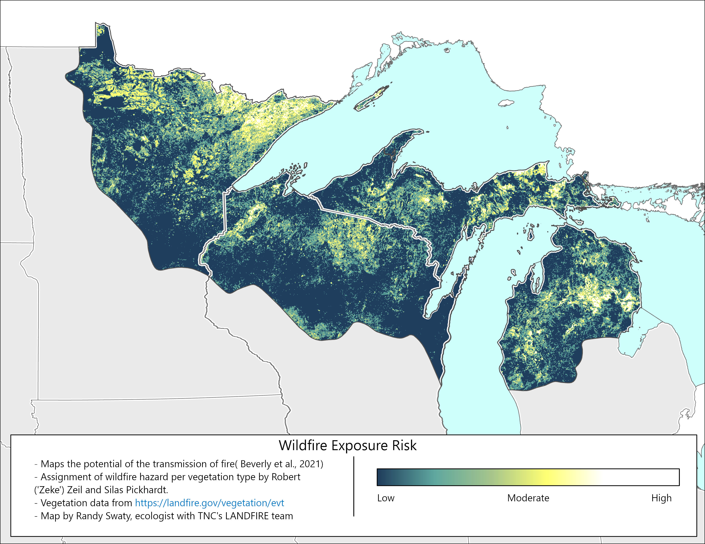
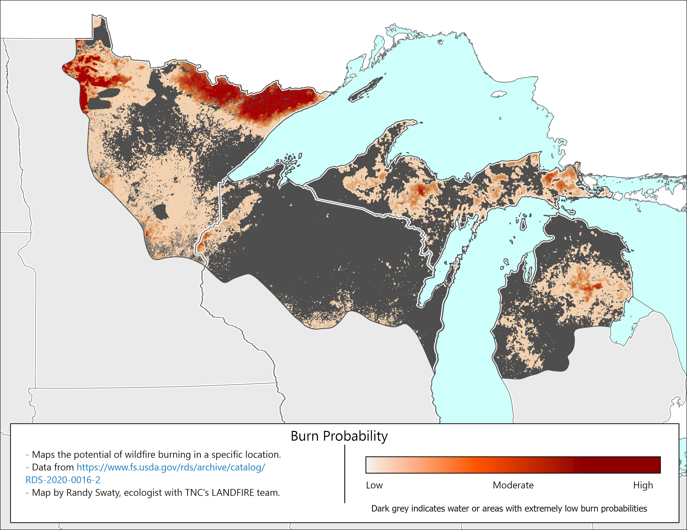

**INCOMPLETE DRAFT FOR INTERNAL CONSUMPTION ONLY**

## Mapping potential for wildfires

Below we present multiple maps that depict wildfire potential in some form.  We present multiple datasets for comparison, but will focus on the Wildfire Exposure Risk map and data as it will form the foundation of future work. 

All known wildfire risk data sets are based in large part on data from the [LANDFIRE](https://landfire.gov/) program.  Others that are not presented below, but that you may have seen or are of interest include:

1. Wildfire risk to properties by [First Street Foundation](https://firststreet.org/) and displayed on sites such as the [NY Times (link to related article)](https://www.nytimes.com/interactive/2022/05/16/climate/wildfire-risk-map-properties.html).
2. [Wildfire Risk by US County](https://databayou.com/states/fire.html)
3. [UrbanFootPrint](https://urbanfootprint.com/blog/sustainable-cities/spotlight-on-wildfire-risk-how-wind-weather-and-wildland-development-are-fueling-extreme-events/)


## Wildfire Exposure Risk Draft Map

Using methods of Dr. Jennifer Beverly (see https://link.springer.com/content/pdf/10.1007/s10980-020-01173-8.pdf), LANDFIRE's [Existing Vegetation Type](https://www.landfire.gov/vegetation/evt) data and transmission hazard assignments from Robert ('Zeke') Zeil and Silas Pickhardt we generated this draft map. For more detailed methods visit an assessment Silas completed for the central region of the Upper Peninsula of MI [here](https://conservation-data-lab.github.io/cup_assessment/fire.html). 

**Breif Methods**

1. LANDFIRE's Existing Vegetation Type (EVT) data for 2024 downloaded and clipped to the Northwoods. The attribute table was exported.
2. Robert Zeil and Silas Pickhardt collaborated to assign each EVT type a 'transmission hazard' score from 0-100, which represents the likeihood that an ember would be transported 500m in the event of a fire.
3. Joined transmission hazard scores to LANDFIRE EVT raster.
4. Focal Statistic Tool was run in ArcGIS pro on the transmission hazard scores with 16 pixels in a circle area selected.  This process "smooths" and contextualizes pixels.  For example, a jack pine pixel (high transmission hazard) in the middle of northern hardwoods pixels gets adjusted "down" (i.e., it poses no hazard), where as a jack pine pixel surrounded by jack pines is a different story. 

Please review the following maps.  One reason we are leaning on this methodology is that it is easy to adjust.  For example we could:

1. Change the transmission hazard ratings to better capture current wildfire exposure risk
2. Develop future scenarios based on expected changes to transmission hazard
3. Adjust the hazard ratings to be 'more sensitive', e.g., change them to represent likelihood of transmitting an ember 100M.

Zeil has used this method for multiple landscapes, and finds that areas mapped with high WFE values are the ones that burn most frequently. 


{style="float:right; margin-left: 5%; fig-align:right; width:100%;" fig-alt=""}
  
  
## Same data, in hexagon form for review

Below is an interactive map where each 10k acre hexagon is colored by the mean Wildfire Exposure Risk value from the map above, and a text category assigned based on the value for ease of review.  This presentation of the data results in a loss of resolution, but is easy to explore and the resulting hexagons increase accuracy through averaging input values.

<br>

```{r}
#| label: leaflet map of wfe setup
#| message: false
#| warning: false
#| include: false

library(leaflet)
library(htmltools)
library(htmlwidgets)
library(sf)
library(scales)
library(tidyverse)


shp <- st_read("inputs/northwoods_wfe.shp", quiet = TRUE) %>% 
  st_transform(crs = 4326) %>%
  st_sf()

#plot(shp)


```


```{r}
#| label: leaflet map
#| echo: false
#| message: false
#| warning: false
#| fig.width: 10
#| fig.height: 10

# Desired order and colors (exact hex)
risk_levels <- c("Very High", "High", "Moderate", "Low", "Very Low")
risk_colors <- c(
  "Very High" = "#FFFFFF",  # white
  "High"      = "#FFFF73",  # yellow
  "Moderate"  = "#A5C48C",  # greenish
  "Low"       = "#5EA79F",  # teal
  "Very Low"  = "#1e344a"   # dark blue
)

# 1) Clean the WFE_CAT values to eliminate hidden mismatches
shp <- shp %>%
  mutate(WFE_CAT = WFE_CAT |> as.character() |> str_trim() |> factor(levels = risk_levels))

# 2) Define a palette with explicit levels; NA polygons will be transparent
pal <- colorFactor(
  palette = unname(risk_colors[risk_levels]), # keep order aligned to risk_levels
  domain  = risk_levels,
  levels  = risk_levels,
  na.color = NA
)

# Popup text
popup_text <- sprintf("Wildfire Exposure Risk Category: %s", shp$WFE_CAT)

# Initial fill opacity (pane opacity will begin here)
initial_opacity <- 1.0

leaflet(shp, options = leafletOptions(preferCanvas = TRUE)) %>%
  addProviderTiles("CartoDB.Positron") %>%
  # --- Create a custom pane for WFE polygons ---
  addMapPane(name = "wfe-pane", zIndex = 410) %>%
  # --- Add polygons into the WFE overlay group and the custom pane ---
  addPolygons(
    group = "WFE",
    options = pathOptions(pane = "wfe-pane"),
    weight = 0.8,
    color = "#444444",
    opacity = 1,                 # stroke opacity
    fillColor = ~pal(WFE_CAT),
    fillOpacity = 1.0,           # individual fill set to 1; overall transparency via pane
    popup = popup_text,
    highlightOptions = highlightOptions(weight = 2, color = "#000", bringToFront = TRUE)
  ) %>%
  # --- Legend (explicit colors/labels, no NA) ---
  addLegend(
    position = "bottomright",
    title = "Wildfire exposure risk",
    colors = risk_colors[risk_levels],
    labels = risk_levels,
    opacity = 1.0
  ) %>%
  # --- Layer control to toggle WFE ---
  addLayersControl(
    overlayGroups = c("WFE"),
    options = layersControlOptions(collapsed = FALSE)
  ) %>%
  # --- Transparency slider UI ---
  addControl(
    position = "topright",
    html = tags$div(
      id = "wfe-opacity-ctl",
      style = "background: rgba(255,255,255,0.95); padding: 8px 10px; border-radius: 6px; box-shadow: 0 1px 4px rgba(0,0,0,0.3); font-family: Arial, sans-serif; font-size: 12px;",
      tags$label(`for` = "wfe-opacity", style = "display:block; margin-bottom:4px;",
                 "WFE transparency"),
      tags$input(
        id = "wfe-opacity",
        type = "range",
        min = "0", max = "1", step = "0.05",
        value = initial_opacity,
        style = "width:160px;"
      ),
      tags$div(id = "wfe-opacity-value",
               style = "margin-top:4px; text-align:right;",
               sprintf("Opacity: %.2f", initial_opacity))
    )
  ) %>%
  # --- JS: prevent map movement + set pane opacity from slider ---
  onRender("
    function(el, x) {
      var map = this;

      // Stop map interactions while using the control
      var ctl = document.getElementById('wfe-opacity-ctl');
      if (ctl && window.L && L.DomEvent) {
        L.DomEvent.disableClickPropagation(ctl);
        L.DomEvent.disableScrollPropagation(ctl);
      }

      var slider = document.getElementById('wfe-opacity');
      var valueLabel = document.getElementById('wfe-opacity-value');

      // Helper to set CSS opacity on the custom pane
      function setPaneOpacity(val) {
        var pane = map.getPane('wfe-pane');
        if (pane) pane.style.opacity = val;
      }

      // Apply initial opacity
      var init = parseFloat(slider.value);
      setPaneOpacity(init);

      // Update as the slider moves
      slider.addEventListener('input', function(e) {
        var val = parseFloat(e.target.value);
        valueLabel.textContent = 'Opacity: ' + val.toFixed(2);
        setPaneOpacity(val);
      });

      // Re-apply when overlay is toggled back on
      map.on('overlayadd', function(ev) {
        if (ev.name === 'WFE') {
          var val = parseFloat(slider.value);
          setPaneOpacity(val);
        }
      });
    }
  ")


```


### Summary of Wildfire Exposure Risk

The highlighted areas generally line up with known fire-prone vegetation types, such as the arrowhead region of MN, the sand plains of NW WI and the central portion of the lower peninsula of MI (to name a few). For future planning maps and/or data may need to be adjusted to be more 'restrictive' so that it is easier to prioritize.


```{r}
#| label: wfe bar chart
#| echo: false
#| message: false
#| warning: false
#| fig.width: 10
#| fig_height: 7


wfe_raw <- read_csv("inputs/wfe_raw.csv")

wfe <- wfe_raw |>
  mutate(across(c('WFE_500m'), round, 2)) |>
  group_by(WFE_500m) |>
  summarize(sum_count = sum(Count)) |>
  mutate(wfe = WFE_500m*100) |>
  mutate(acres = sum_count* 0.2223945) |>
  mutate(quantiles = cut(wfe, 
                        breaks = c(
                          -1,
                          20,
                          40,
                          60,
                          80,
                          100),
                        labels = c(
                          "0 - 20",
                          "20 - 40",
                          "40 - 60",
                          "60 - 80",
                          "80 - 100")))


# Reorder levels of quantiles in reverse order
wfe$quantiles <- factor(wfe$quantiles, levels = rev(levels(wfe$quantiles)))

# group by quantiles for chart
wfe_quantiles <- wfe %>%
  group_by(quantiles) %>%
  summarize(total_acres = sum(acres)) %>%
  mutate(percentage = round(total_acres/sum(total_acres)*100)) |>
  arrange(desc(percentage))

# Reorder levels of quantiles in reverse order
wfe_quantiles$quantiles <- factor(wfe_quantiles$quantiles, levels = (levels(wfe_quantiles$quantiles)))

# make chart

wfe_quantiles_chart <-
  ggplot(wfe_quantiles, aes(x = quantiles, y = total_acres, fill = quantiles)) +
  geom_bar(stat = 'identity', color = '#3d3d3d') +
  coord_flip() +
  labs(
    x = "",
    y = "Total acres per category",
    title = "Wildfire Exposure Risk",
    subtitle = "Colors match map",
    caption = "Categorized; 0 - 20 is the lowest risk category, 80 -100 the highest.") +
  scale_fill_manual(values = c(
    "#FFFFFF",
    "#F3F583",
    "#A5C48C",
    "#5EA79F",
    "#1e344a")) +
  scale_y_continuous(labels = comma) +
  geom_text(aes(label = paste0("  ", percentage, "%")),
            vjust = -0.5, 
            hjust = -0.10, 
            color = "#3d3d3d",
            size = 4) + 
  theme_bw(base_size = 18) +
  theme(axis.line = element_line(colour = "black"),
        panel.grid.major = element_blank(),
        panel.grid.minor = element_blank(),
        panel.border = element_blank(),
        panel.background = element_blank()) +
  theme(legend.position = 'none')+
  # theme(plot.margin = margin(0, #top
  #                            3, #right
  #                            0, # bottom
  #                            0, #left
  #                            "cm")) + 
  expand_limits(y = 5000000) 


wfe_quantiles_chart


```

## Burn probability

This data set represents "the annual probability of wildfire burning in a specific location" and was downloaded [here](https://data-usfs.hub.arcgis.com/datasets/usfs::wildfire-risk-to-communities-burn-probability-image-service/about).  It is developed through a fairly complex and robust process described in a white paper by [Scott et al. (2024)](https://wildfirerisk.org/wp-content/uploads/2024/05/WildfireRiskToCommunities_V2_Methods_Landscape-wideRisk.pdf).  While useful for comparison and 'triangulation' with other data sets, we do not plan to base future-looking scenarios on this Burn Probability data. 

<br>
{style="float:right; margin-left: 5%; fig-align:right; width:100%;" fig-alt=""}
  
## Wildfire Hazard Potential

Wildfire Hazard Potential depicts "the relative potential for high-intensity wildfire that may be difficult to manage" ([Dillon et al. (2024)](https://research.fs.usda.gov/firelab/products/dataandtools/wildfire-hazard-potential)).  Another robust dataset, it relies on heavy modeling and fairly complex methods.


